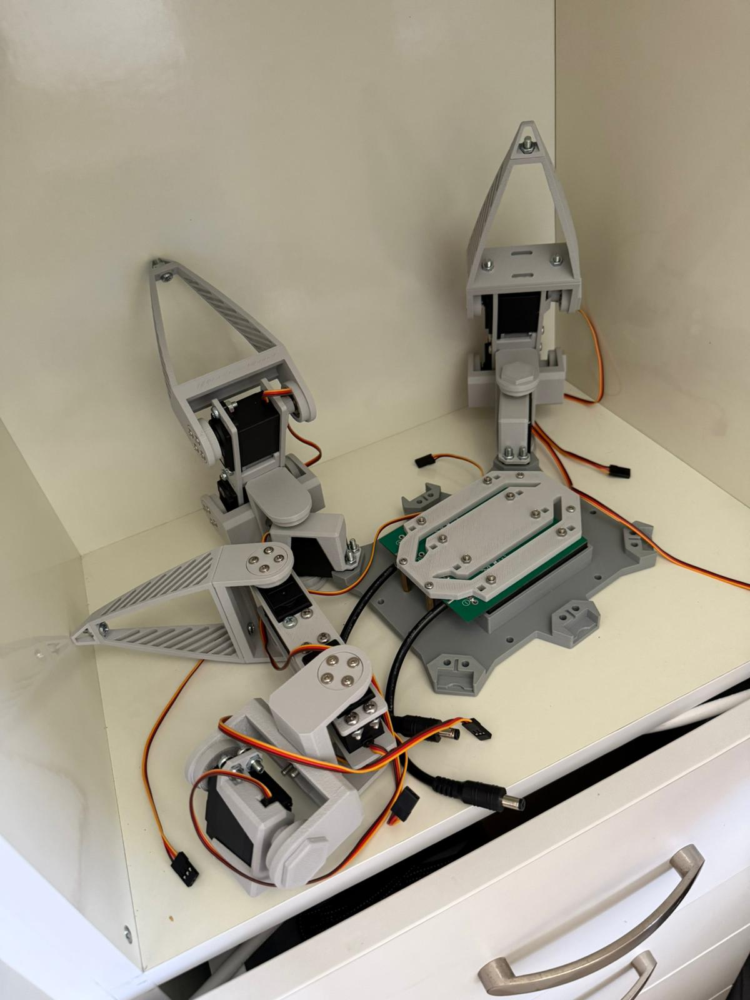
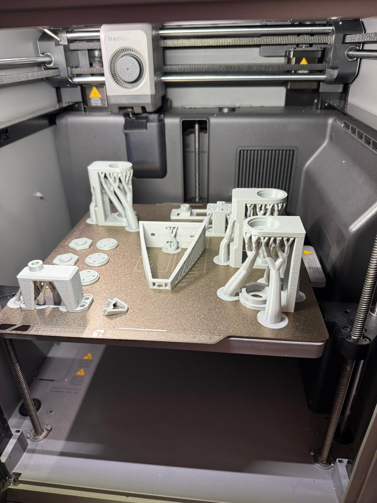

# Hexapod Robot

A custom-designed 6-legged robot built from scratch, featuring 3D-printed parts, MG996R servos, and a Raspberry Pi 5 running ROS2.

## Status

**Work in progress** — all milestones so far are done: the robot

https://github.com/user-attachments/assets/ba36490c-4319-432a-bacf-54f89491a823

 is fully assembled, walks (tripod gait) and turns. Gait parameters can likely still be tuned for smoother motion. Next goal: add a camera and start processing its signal.

- [x] CAD design (legs, chassis, battery holder)
- [x] STL exports
- [x] 3 legs assembled
- [x] Full 6-leg assembly
- [x] PCB + Raspberry Pi integration
- [x] Inverse kinematics
- [x] Walking cycle / gait control (walking + turning)
- [ ] Camera integration
- [ ] Camera signal processing

## Assembly Preview

  
  

## Hardware

| Component | Details |
|---|---|
| Brain | Raspberry Pi 5 |
| Servos | MG996R × 18 (3 per leg) |
| PCB | Freenove Big Hexapod Robot PCB (reused) |
| Battery | 18500 flat cells |
| Frame | Custom 3D-printed (FreeCAD) |

## 3D Printed Parts

All STL files are in [cad/stl/](cad/stl/). Source FreeCAD files are in [cad/freecad/](cad/freecad/).

**Leg** (× 6):
- `coxa_mount.stl`
- `coxa_vertical.stl`
- `coxa_horizontal.stl`
- `femur_mount1.stl`
- `femur_mount2.stl`
- `tibia_mount.stl`
- `tibia.stl`
- `foot.stl`

**Body:**
- `chassis.stl`
- `battery_holder.stl`

Each leg has 3 degrees of freedom (coxa / femur / tibia joints), driven by one MG996R servo each.

## Software Stack

- **OS:** Raspberry Pi OS
- **Language:** Python (control code in [code/](code/), remote client in [client/](client/))
- [x] Inverse kinematics
- [x] Gait controller (tripod gait, walking + turning)
- [x] Client/server remote control
- [ ] Camera + vision processing

## Roadmap

1. ~~Complete 6-leg mechanical assembly~~
2. ~~Mount PCB and Raspberry Pi 5 to chassis~~
3. ~~Wire all 18 servos to PCB~~
4. ~~Implement IK solver~~
5. ~~Implement walking cycle / gait (walking + turning)~~
6. Tune gait parameters
7. Add a camera and process its signal
